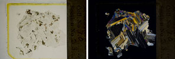
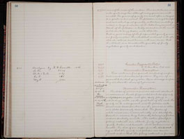

# LSLC-Web-App
Web Application for viewing the WGNHS Lake Superior Legacy Collection

### Origins of the collection 
This collection of geologic samples originates with geologists studying the Lake Superior region from the 1880s through the first two decades of the 1900s. These geologists embarked on field expeditions, where they collected **hand samples**, or chucks of rock that could be held in the palm of a hand, and recorded their observations in **field notebooks**. The hand samples were brought back to Madison, where some were cut to create one or more **thin sections**, or thin slices of rock which allow light to pass through. These thin sections were viewed under a microscope in both plane-polarized and cross-polarized light. Geologists then wrote **lithological descriptions** of some of the thin sections based on their observations using a microscope. 

### Digitized

The Wisconsin Geological and Natural History survey has received funding to digitize this extensive collection of geologic samples and data. 

| Item                         | How many? | Digitized representation                                  |   |
|------------------------------|---|-----------------------------------------------------------|---|
| field notebooks               | 491 | PDF scans                                                  |   |
| hand samples                  | over 9,700 | photos (if we still have it)                                                          |   |
| thin sections (microscope slide)                | over 26,000 | high-resolution photos in plane-polarized and cross-polarized light|   |
| books of lithological descriptions | 6 | PDF scans                                                 |   |  |

### Visualize
This web interface is currently under construction. The goal of the interface is to provide a way for users to search, view, and download our Lake Superior Legacy Collection data, including photos of rock samples and their associated field notes, microscope slides, and descriptions. 
